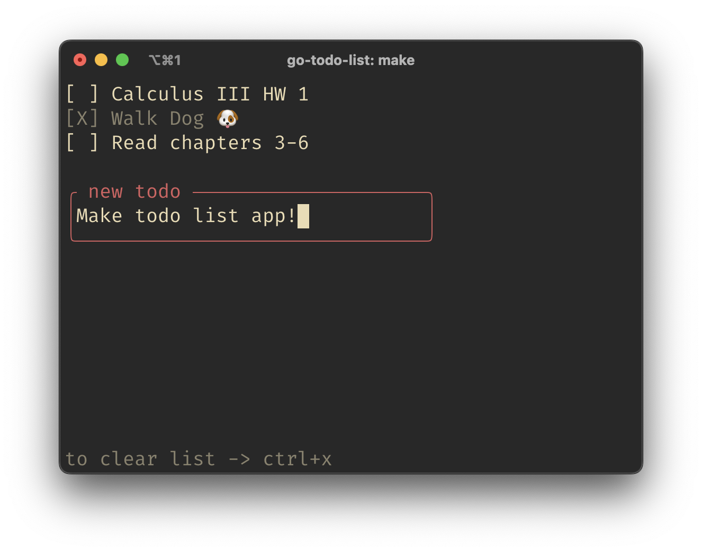

# TUI Todo List written in go

### Loads and saves from local csv file.

## Preview

## Build

Run `make build` and copy the executable in /bin

## Keymap

tab -> move down  
shift + tab -> move up
ctrl + x -> clear list
